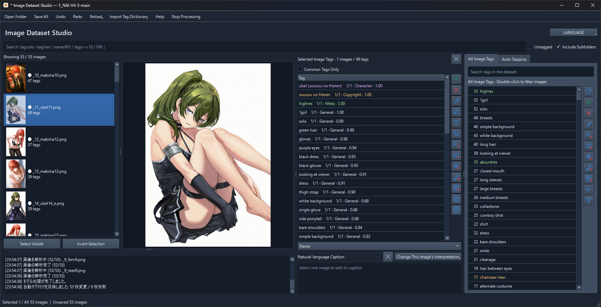

# Image Dataset Studio

English | [日本語](README_JP.md)



A Windows desktop app for editing and generating tags and natural language captions for image datasets. The interface supports English and Japanese.

- Batch tag editing, reordering, search, undo, and redo
- Tag and caption generation with local models
- Editing datasets with tags, captions, or both

## Getting started

Install `uv`, then run these commands from the repository folder:

```powershell
.\install.bat
.\start.bat
```

Python and dependencies are installed automatically. The installer creates CPU and CUDA environments, and the launcher selects an available environment. GPU use requires a compatible NVIDIA driver.

## Usage

1. Click **Open Folder** and select a folder containing images.
2. Select images to edit their tags and captions, or generate them from the **Auto Tagging** tab.
3. Click **Save All** or press `Ctrl+S` to save. Use `Ctrl+Z` / `Ctrl+Y` to undo and redo edits.

Tags and captions are saved in `.txt` files with the same base name as each image. Images are not modified. When a file contains both tags and a caption, the first blank line separates them. Metadata, including the reading format, is stored in `.image-dataset-studio.json`.

Files without metadata are read as tags by default. For captions or mixed content, choose the reading format from **Reload** in the top toolbar.

## Supported models

- Tags: PixAI, WD, Camie, IdolSankaku
- Captions: Florence-2, Qwen3-VL, JoyCaption

Models are downloaded on first use. For PixAI and Florence-2, enable **Allow This Model's Python Code** in the interface. Each model is subject to its publisher's license.

## Building an executable

```powershell
.\scripts\build.ps1
```

The output is `dist\ImageDatasetStudio\`. 
