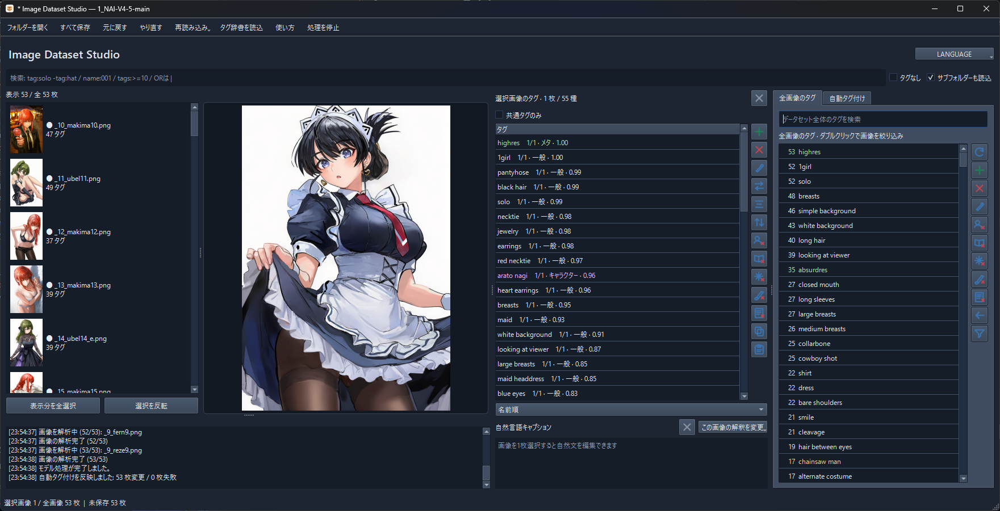

# Image Dataset Studio

[English](README.md) | 日本語



画像データセットのタグと自然言語キャプションを編集・生成するWindowsデスクトップアプリです。日本語・英語の表示に対応しています。

- タグの一括編集、並べ替え、検索、元に戻す／やり直す
- ローカルモデルによるタグ・自然言語キャプションの生成
- タグのみ、キャプションのみ、両方を含むデータセットの編集

## 起動

`uv` をインストールし、リポジトリのフォルダーで実行してください。

```powershell
.\install.bat
.\start.bat
```

Pythonと依存関係は自動で導入します。CPU・CUDA用の環境を作成し、起動時に利用できる環境を選びます。GPUの利用には対応するNVIDIAドライバーが必要です。

## 使い方

1. 「フォルダーを開く」で画像のあるフォルダーを選びます。
2. 画像を選択してタグ・キャプションを編集するか、「自動タグ付け」タブで生成します。
3. 「すべて保存」または `Ctrl+S` で保存します。編集履歴は `Ctrl+Z` / `Ctrl+Y` で操作できます。

画像と同名の `.txt` に保存し、画像自体は変更しません。タグとキャプションの両方がある場合は、最初の空行を境界にします。読み込み形式などの管理情報は `.image-dataset-studio.json` に保存します。

管理情報がない `.txt` はタグとして読み込みます。自然文や混合形式の場合は、上部の「再読み込み」から読み込み形式を選んでください。

## 対応モデル

- タグ：PixAI、WD、Camie、IdolSankaku
- キャプション：Florence-2、Qwen3-VL、JoyCaption

モデルは初回利用時にダウンロードします。PixAI・Florence-2では、画面上でモデルのPythonコード実行を許可してください。各モデルの利用条件は配布元のライセンスに従います。

## exeの作成

```powershell
.\scripts\build.ps1
```

出力は `dist\ImageDatasetStudio\` です。配布する場合はフォルダー全体が必要です。
